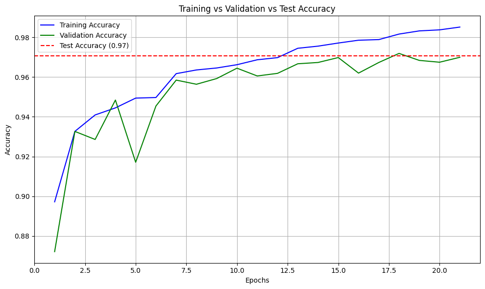
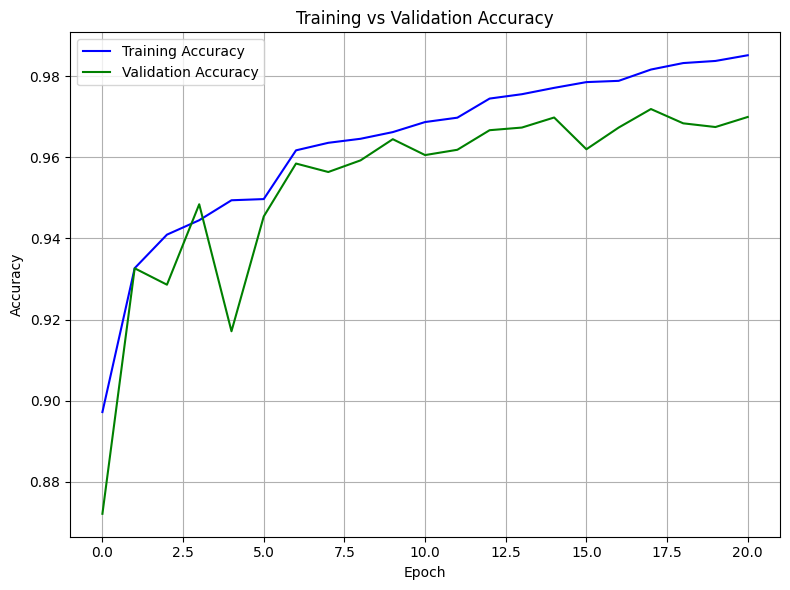
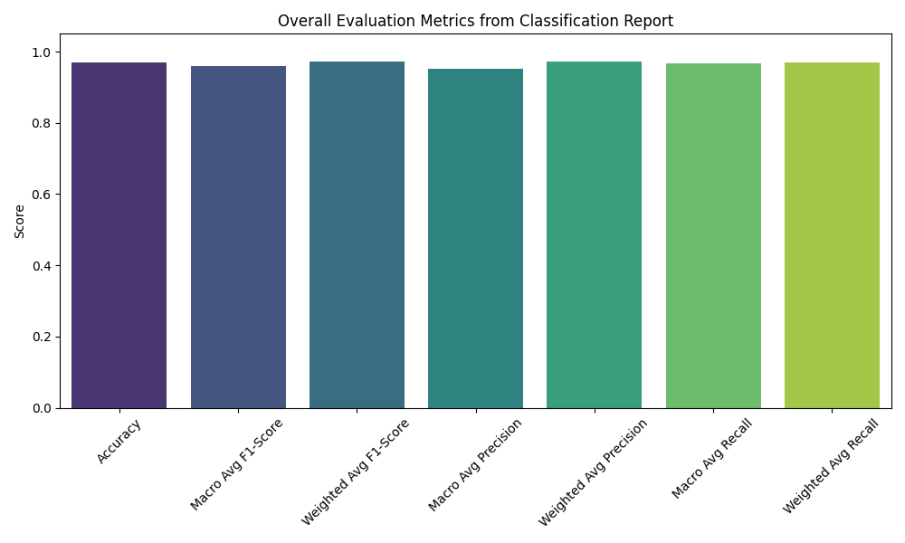
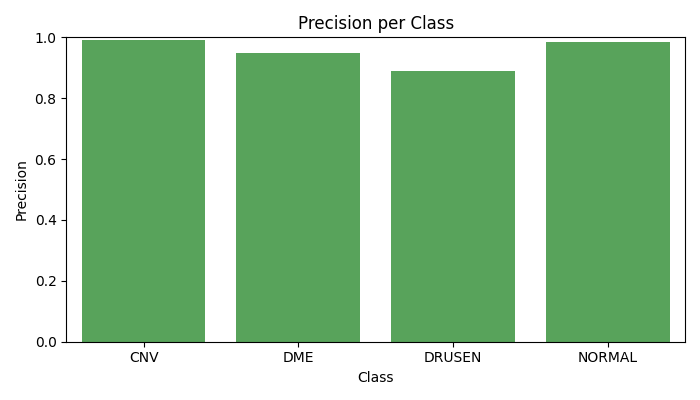

# Opti-Light | Retinal Disease Detection using OCT Images

**Opti-Light** is a deep learning-based system that detects retinal diseases **DME**, **CNV**, and **Drusen** from Optical Coherence Tomography (OCT) images.  
The model uses a **Dual Fusion Architecture** that combines **ResNet50 deep features** with **GLCM texture features** to improve classification accuracy.

---

## 📌 Features
- **Dual Fusion Model**: Combines CNN (ResNet50) deep features with handcrafted texture features (GLCM).
- Detects **3 retinal diseases** with high accuracy.
- Achieved **97% classification accuracy** on the Kaggle OCT dataset.
- End-to-end pipeline: Training, Testing, and Evaluation.

---

## 🛠 Technologies Used
- Python
- TensorFlow / Keras
- OpenCV
- Deep learning

---

## 📂 Dataset
The dataset used is from Kaggle:  
[AP_Refined Optical Coherence Tomography Images](https://www.kaggle.com/datasets/khushikimmatka/ap-refined-optical-coherence-tomography-images)
It contains four categories:
- **CNV** (Choroidal Neovascularization)
- **DME** (Diabetic Macular Edema)
- **DRUSEN**
- **NORMAL**

---
## 📊 Results

### **Accuracy & Loss**

### **Confusion Matrix**

### **Metrics**

