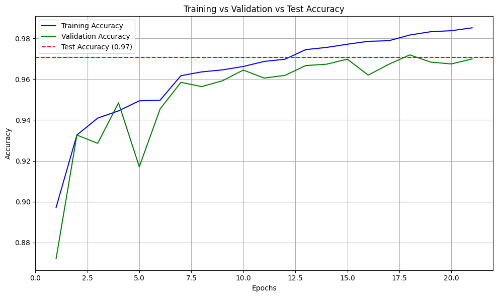
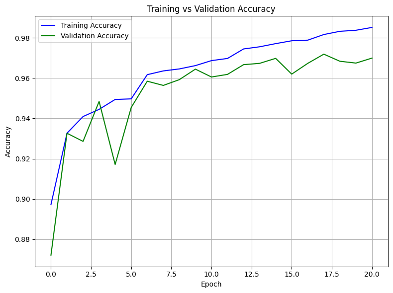
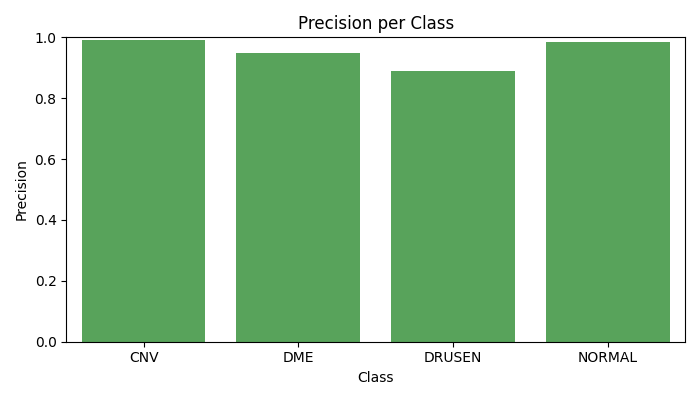
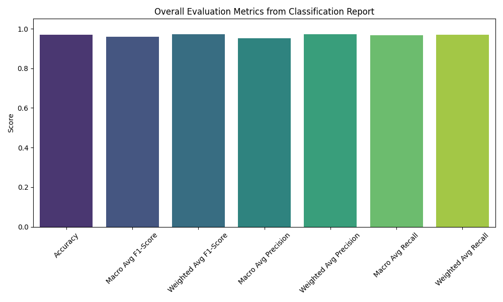

# 👁️ Optilight — Retinal Disease Detection using OCT Images

## 📋 Project Overview

Optilight is an AI-assisted web application designed for retinal disease classification using Optical Coherence Tomography (OCT) images. The system evaluates B-scan OCT cross-sections and categorizes them into one of four diagnostic classes:

- **CNV** — Choroidal Neovascularization
- **DME** — Diabetic Macular Edema
- **DRUSEN** — Drusen
- **NORMAL** — Normal Retina

The platform is structured as a decoupled web application comprising:
- A modern single-page frontend built with React 18, Vite, React Router, and Bootstrap 5.
- A RESTful backend powered by FastAPI and Uvicorn.
- A dual-branch machine learning pipeline combining deep convolutional features from ResNet50 with texture descriptors from Gray-Level Co-occurrence Matrix (GLCM) analysis.
- A relational database layer managed via SQLAlchemy with SQLite (default) and MySQL compatibility.
- User authentication and access control implemented using JSON Web Tokens (JWT) with HTTP Bearer authorization.

Optilight is developed as an assistive clinical decision support tool to aid ophthalmologists and clinicians in analyzing OCT scans. It is not intended to provide autonomous medical diagnoses.


------------------------------------------------------------------------

## 📑 Table of Contents

-   [🏗️ System Architecture](#️-system-architecture)
-   [📁 Repository Structure](#-repository-structure)
    -   [🧩 Module Overview](#-module-overview)
-   [⚙️ How It Works](#️-how-it-works)
    -   [📤 OCT Image Upload](#-oct-image-upload)
    -   [🔬 Prediction Results](#-prediction-results)
    -   [📜 Prediction History](#-prediction-history)
    -   [👤 User Profile](#-user-profile)
-   [🧠 Machine Learning Approach](#-machine-learning-approach)
    -   [🖼️ ResNet50](#️-resnet50)
    -   [🔲 GLCM](#-glcm)
-   [🔗 Feature Fusion](#-feature-fusion)
-   [🎯 Supported Classes](#-supported-classes)
-   [🚀 Getting Started](#-getting-started)
    -   [📌 Prerequisites](#-prerequisites)
    -   [💻 Repository Setup](#-repository-setup)
-   [🛠️ Backend Setup](#️-backend-setup)
    -   [🧪 Standalone CLI
        Inference](#-standalone-cli-inference-optional)
-   [🌐 Frontend Setup](#-frontend-setup)
-   [📡 API Overview](#-api-overview)
-   [📊 Model Performance](#-model-performance)
    -   [📈 Class-Wise Evaluation
        Metrics](#-class-wise-evaluation-metrics)
-   [🖼️ All Screenshots](#️-all-screenshots)
    -   [💻 Application Screenshots](#-application-screenshots)
    -   [📊 Model Evaluation
        Screenshots](#-model-evaluation-screenshots)

------------------------------------------------------------------------

## 🏗️ System Architecture

The following diagram illustrates the high-level architecture and data flow across the application:

```
React Frontend
       |
       | REST API / HTTP
       v
FastAPI Backend
       |
       +----------------------+
       |                      |
       v                      v
Database                ML Inference Pipeline
(SQLite / MySQL)              |
                       +------+------+
                       |             |
                       v             v
                    ResNet50       GLCM
                       |             |
                       +------+------+
                              |
                              v
                       Feature Fusion
                              |
                              v
                        Classification
                              |
                              v
                    CNV / DME / DRUSEN
                           / NORMAL
```

1. **Client Layer:** The user interacts with the React single-page application to upload OCT images, review classification probabilities, examine prediction history, and manage account details.
2. **API & Service Layer:** FastAPI handles HTTP requests, validates JWT authorization tokens, processes file uploads, and coordinates database operations.
3. **Machine Learning Pipeline:** Received images undergo preprocessing, feature extraction through ResNet50 and GLCM branches, vector fusion, and final Softmax classification.
4. **Persistence Layer:** SQLAlchemy manages user profiles and stores chronological prediction logs, probability distributions, and scan metadata.

---

## 📁 Repository Structure

```
Opti-Light-Retinal_Disease_Detection/
│
├── backend/
│   ├── app/
│   │   ├── api/routes/          # API route handlers (auth, prediction, health)
│   │   ├── core/                # JWT utilities and password hashing
│   │   ├── db/                  # Database models and session engine
│   │   ├── ml/                  # Preprocessing, GLCM extraction, and model loading
│   │   ├── services/            # Prediction orchestration service
│   │   └── main.py              # FastAPI application entry point
│   ├── model/                   # Model weights (best_model.h5) and saved_scaler.pkl
│   ├── uploads/                 # Storage directory for uploaded OCT scan files
│   ├── predict.py               # Standalone command-line inference script
│   ├── requirements.txt         # Backend Python dependencies
│   └── .env.example             # Backend environment variable template
│
├── docs/
│   └── screenshots/             # Application interface and evaluation figures
│       ├── About-1.png
│       ├── About-2.png
│       ├── HomePage.png
│       ├── History.png
│       ├── accuracy_graph.png
│       ├── TrainvsVal_acc_graph.png
│       ├── confusion_matrix.png
│       ├── f1-score_per_class.png
│       ├── precision_per_class.png
│       ├── recall_per_class.png
│       └── overall_metrics_summary.png
│
├── frontend/
│   ├── public/                  # Static assets and brand logos
│   ├── src/
│   │   ├── api/                 # Axios API service integrations
│   │   ├── components/          # Reusable UI components (Sidebar, Layout, Modals)
│   │   ├── context/             # Authentication context and global session state
│   │   ├── pages/               # Views (NewAnalysis, History, Profile, About, Auth)
│   │   ├── services/            # API client configurations
│   │   ├── App.jsx              # Client router and route protection
│   │   ├── index.css            # Styling and visual theme rules
│   │   └── main.jsx             # React application entry point
│   ├── package.json             # Frontend package configurations and scripts
│   ├── package-lock.json        # Deterministic dependency tree
│   ├── vite.config.js           # Vite development and bundle configuration
│   └── .env.example             # Frontend environment variable template
│
├── Logs/
│   └── training_log.csv         # Epoch-wise training and validation logs
│
├── Notebook/
│   ├── Testing.ipynb            # Model evaluation and metric calculation notebook
│   └── Training.ipynb           # Model training and feature extraction notebook
│
├── .gitignore                   # Git exclusion rules
└── README.md                    # Main project documentation
```

### 🧩 Module Overview

- **backend/**: Contains the FastAPI application, database schemas, authentication workflows, GLCM texture extraction logic, and the trained model pipeline.
- **frontend/**: Contains the React application, client-side routing, responsive UI views, state management, and API connection logic.
- **docs/screenshots/**: Houses application interface previews and model evaluation graphs.
- **Logs/**: Contains training logs including epoch-by-epoch loss and accuracy metrics.
- **Notebook/**: Contains Jupyter notebooks detailing the model training pipeline, feature fusion experimentation, and testing workflows.

---

## ⚙️ How It Works

### 📤 OCT Image Upload

1. The user logs in and navigates to the **New Analysis** view.
2. The user selects a retinal OCT scan image (`.jpg`, `.jpeg`, or `.png`).
3. An image preview is displayed immediately within the interface to confirm selection.
4. The user clicks **Analyze Scan**.
5. The frontend transmits the file via a `multipart/form-data` request to the backend prediction endpoint (`POST /api/predictions`) alongside the user's Bearer authentication token.

### 🔬 Prediction Results

The backend processes the uploaded OCT image through the following inference workflow:

```
OCT Image
    |
Image Preprocessing
    |
+-----------+-----------+
|                       |
ResNet50                GLCM
|                       |
Deep Features           Texture Features
|                       |
+-----------+-----------+
            |
      Feature Fusion
            |
      Classification
            |
      Prediction Result
```

1. **Validation & Storage:** The uploaded file extension is verified, assigned a unique identifier, and saved to the local `uploads/` directory.
2. **Dual-Branch Extraction:** The image is preprocessed and concurrently analyzed by the deep ResNet50 network and the GLCM statistical texture extractor.
3. **Inference & Logging:** Feature vectors are combined and evaluated by the classifier. The resulting prediction, confidence score, and per-class probability distribution are saved to the database.
4. **Display:** The frontend **Analysis Result** page renders:
   - The primary predicted condition badge (CNV, DME, DRUSEN, or NORMAL).
   - An overall confidence percentage.
   - Individual probability progress bars for all four conditions.
   - An interactive view of the uploaded OCT scan with clinical summary notes.

### 📜 Prediction History

- Authenticated users can access the **History** page to review all previously submitted analyses.
- Prediction records are fetched chronologically from `GET /api/predictions/history`.
- The interface displays the scan thumbnail, predicted disease label, confidence percentage, date, and timestamp.
- Users can view detailed breakdowns for any past record (`GET /api/predictions/{id}`).
- Users can delete individual records (`DELETE /api/predictions/{id}`), which removes both the database entry and the corresponding image file from server storage.

### 👤 User Profile

- The **Profile** page retrieves the authenticated user's information via `GET /api/auth/me`.
- Displays the user's registered name, email address, and account creation date.
- Provides session controls including a secure logout action.

---

## 🧠 Machine Learning Approach

The classification architecture uses a dual-branch feature extraction pipeline designed to capture both macro-structural retinal morphology and fine micro-textural patterns.

```
                    +-----------------------+
                    |    Input OCT Scan     |
                    +-----------+-----------+
                                |
                +---------------+---------------+
                |                               |
                v                               v
    +-----------------------+       +-----------------------+
    |       ResNet50        |       |         GLCM          |
    |  Deep Feature Branch  |       | Texture Feature Branch|
    +-----------+-----------+       +-----------+-----------+
                |                               |
                v                               v
          Deep Features                  Texture Features
        (Spatial Semantics)            (Statistical Texture)
                |                               |
                +---------------+---------------+
                                |
                                v
                    +-----------------------+
                    |    Feature Fusion     |
                    +-----------+-----------+
                                |
                                v
                    +-----------------------+
                    |    Classification     |
                    |    (Softmax Layer)    |
                    +-----------+-----------+
                                |
                                v
                    +-----------------------+
                    |  4 Diagnostic Classes |
                    +-----------------------+
```

### 🖼️ ResNet50

- A pre-trained ResNet50 convolutional neural network is employed as a spatial feature extractor.
- Input scans are formatted to $224 \times 224 \times 3$ RGB representations and normalized.
- The network extracts deep representations that capture layer curvatures, foveal depressions, structural elevations, and fluid accumulations.

### 🔲 GLCM

- Gray-Level Co-occurrence Matrix (GLCM) extraction evaluates second-order statistical texture distributions within the OCT cross-sections.
- Scans are converted to grayscale and resized to $224 \times 224$.
- Co-occurrence matrices are computed across pixel distances $[1, 2, 3]$ and angles $[0, \frac{\pi}{4}, \frac{\pi}{2}, \frac{3\pi}{4}]$.
- Six statistical texture descriptors are extracted:
  1. **Contrast** — Measures local intensity variations.
  2. **Dissimilarity** — Measures the variation of gray-level pairs.
  3. **Homogeneity** — Evaluates the closeness of element distribution to the GLCM diagonal.
  4. **Energy** — Measures textural uniformity.
  5. **Correlation** — Evaluates linear dependency of gray levels of neighboring pixels.
  6. **Angular Second Moment (ASM)** — Measures orderly textural characteristics.
- Extracted features are normalized using a pre-fitted `StandardScaler` (`saved_scaler.pkl`).

---

## 🔗 Feature Fusion

The deep convolutional features extracted by ResNet50 and the statistical texture features generated by GLCM are concatenated into a unified representation vector before classification:

```
OCT Image
   |
   +------------------+
   |                  |
   v                  v
ResNet50             GLCM
   |                  |
Deep Features      Texture Features
   |                  |
   +--------+---------+
            |
      Feature Fusion
            |
      Classification
            |
      4-Class Output
```

1. **Integration:** Spatial representations capturing anatomical layer geometry and statistical descriptors capturing local reflective variations are combined.
2. **Dense Classification:** The fused vector is processed through dense neural network layers with dropout regularization.
3. **Probability Output:** A final 4-unit Softmax activation layer produces a normalized probability distribution across the target retinal conditions.

---

## 🎯 Supported Classes

| Class | Full Name | Description |
|---|---|---|
| **CNV** | Choroidal Neovascularization | Abnormal growth of new blood vessels originating from the choroid through Bruch's membrane into the sub-retinal space, often accompanied by subretinal fluid or exudation. |
| **DME** | Diabetic Macular Edema | Retinal thickening and fluid accumulation within the macula resulting from damaged retinal microvasculature associated with diabetes mellitus. |
| **DRUSEN** | Drusen | Extracellular lipid-rich deposits accumulating between the retinal pigment epithelium (RPE) and Bruch's membrane, representing a key hallmark of age-related macular degeneration. |
| **NORMAL** | Normal Retina | Healthy retinal morphology characterized by preserved foveal architecture, intact and continuous anatomical layers, and absence of fluid or deposits. |

---

## 🚀 Getting Started

### 📌 Prerequisites

- **Python**: Version 3.10 or newer
- **Node.js**: Version 18 or newer
- **npm**: Package manager (included with Node.js)
- **Git**: Version control system

### 💻 Repository Setup

Clone the repository to your local machine:

```bash
git clone https://github.com/Gauravchaple/Opti-Light-Retinal_Disease_Detection.git
cd Opti-Light-Retinal_Disease_Detection
```

The backend and frontend services must be configured and executed in separate terminal sessions.

---

## 🛠️ Backend Setup

1. Open a terminal and navigate to the `backend/` directory:

```bash
cd backend
```

2. Create and activate a Python virtual environment:

```powershell
# Create virtual environment
python -m venv venv

# Activate on Windows PowerShell:
.\venv\Scripts\activate

# Activate on Linux / macOS:
# source venv/bin/activate
```

3. Install the required Python packages:

```bash
pip install -r requirements.txt
```

4. Configure the environment variables (optional, defaults provided):

```bash
cp .env.example .env
```

5. Start the FastAPI development server:

```bash
python -m uvicorn app.main:app --reload
```

- **Backend Base URL**: `http://127.0.0.1:8000`
- **Interactive Swagger Documentation**: `http://127.0.0.1:8000/docs`

#### 🧪 Standalone CLI Inference (Optional)

You can run predictions directly from the command line without starting the web server:

```bash
python predict.py test_sample.jpeg
```

---

## 🌐 Frontend Setup

1. Open a new terminal and navigate to the `frontend/` directory:

```bash
cd frontend
```

2. Install the necessary Node.js dependencies:

```bash
npm install
```

3. Configure the environment variables (optional, defaults to backend port 8000):

```bash
cp .env.example .env
```

The default `.env` configuration contains:
```env
VITE_API_BASE_URL=http://127.0.0.1:8000
```

4. Start the Vite development server:

```bash
npm run dev
```

- **Web Application URL**: `http://localhost:5173`

---

## 📡 API Overview

The FastAPI backend exposes the following RESTful API endpoints:

| Method | Endpoint | Description | Authentication |
|---|---|---|:---:|
| `POST` | `/api/auth/register` | Register a new practitioner account with name, email, and password | None |
| `POST` | `/api/auth/login` | Authenticate user credentials and return a Bearer JWT access token | None |
| `GET` | `/api/auth/me` | Retrieve the authenticated user's profile details | Bearer JWT |
| `POST` | `/api/predictions` | Upload an OCT image file (`.jpg`, `.jpeg`, `.png`) for disease classification | Bearer JWT |
| `GET` | `/api/predictions/history` | Retrieve chronological prediction history for the authenticated user | Bearer JWT |
| `GET` | `/api/predictions/{id}` | Fetch full diagnostic breakdown and probabilities for a specific prediction | Bearer JWT |
| `DELETE` | `/api/predictions/{id}` | Delete a prediction record and its associated image file from disk | Bearer JWT |
| `GET` | `/api/health` | Check general backend system readiness | None |
| `GET` | `/api/health/model` | Verify ML model availability and return input tensor shapes | None |

---

## 📊 Model Performance

The model evaluation results documented on the dataset test partition are summarized below:

| Metric | Value |
|---|:---:|
| **Overall Accuracy** | **97.1%** |
| **Macro F1-Score** | **0.96** |

### 📈 Class-Wise Evaluation Metrics

| Class | Precision | Recall | F1-Score |
|---|:---:|:---:|:---:|
| **CNV** | 0.99 | 0.98 | 0.98 |
| **DME** | 0.95 | 0.97 | 0.96 |
| **DRUSEN** | 0.89 | 0.95 | 0.92 |
| **NORMAL** | 0.98 | 0.97 | 0.98 |

*Note: These metrics reflect evaluation on the project test dataset split and are presented for technical and academic assessment.*

---

## 🖼️ All Screenshots

### 💻 Application Screenshots

#### 📤 New Analysis


#### 📜 Prediction History


#### ℹ️ About Optilight — Part 1


#### ℹ️ About Optilight — Part 2


### 📊 Model Evaluation Screenshots

#### 📈 Training Accuracy


#### 📉 Training vs Validation Accuracy


#### 🔲 Confusion Matrix


#### 🎯 F1-Score Per Class


#### 🎯 Precision Per Class


#### 🎯 Recall Per Class


#### 📊 Overall Metrics


---
