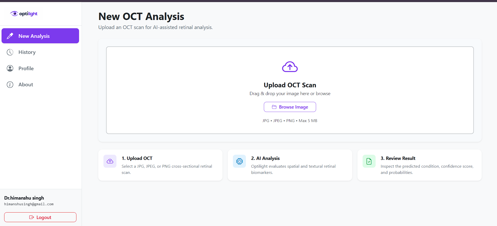
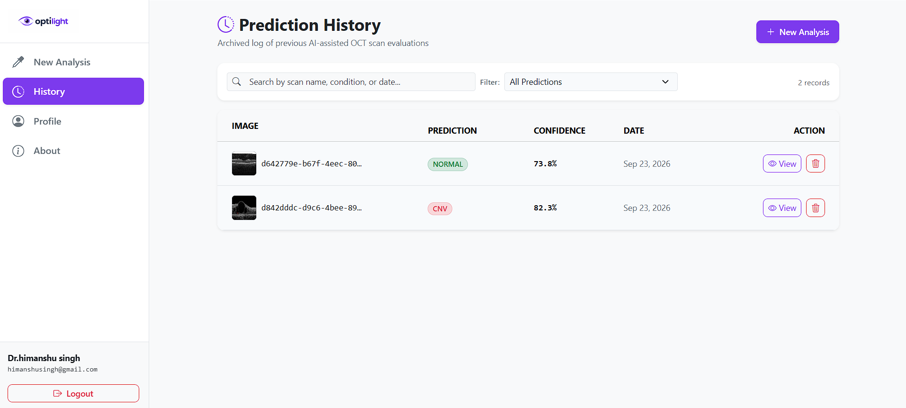
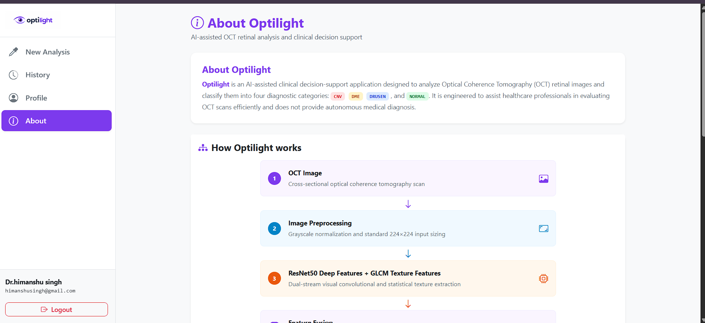
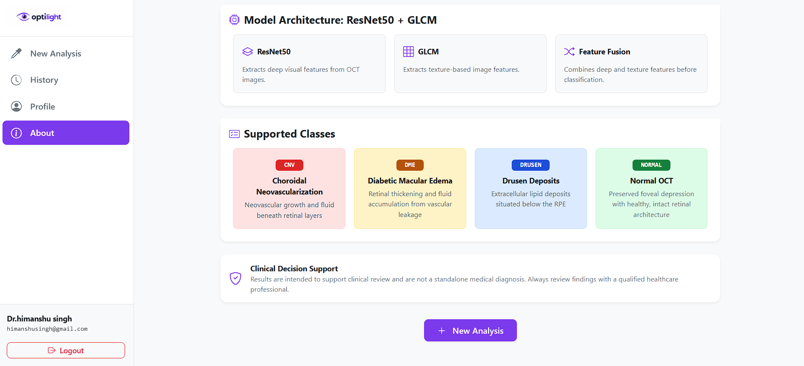

# Optilight — Retinal Disease Detection using OCT Images

[](https://www.python.org/)
[](https://fastapi.tiangolo.com/)
[](https://react.dev/)
[](https://www.tensorflow.org/)
[](https://getbootstrap.com/)
[](LICENSE)

An end-to-end, AI-assisted clinical decision support system designed to classify Optical Coherence Tomography (OCT) retinal images into four diagnostic categories: **CNV**, **DME**, **DRUSEN**, and **NORMAL**. The system pairs a dual-stream deep learning and texture feature extraction pipeline with a high-performance FastAPI backend and a responsive clinical React dashboard.

---

## 📑 Table of Contents
1. [Project Overview](#-project-overview)
2. [Key Features](#-key-features)
3. [System Architecture](#-system-architecture)
4. [Machine Learning Approach: ResNet50 + GLCM](#-machine-learning-approach)
5. [Supported Diagnostic Classes](#-supported-diagnostic-classes)
6. [Repository Structure](#-repository-structure)
7. [Getting Started & Installation](#-getting-started--installation)
   - [Prerequisites](#prerequisites)
   - [Backend Setup](#1-backend-setup)
   - [Frontend Setup](#2-frontend-setup)
8. [API Overview](#-api-overview)
9. [Model Performance & Evaluation](#-model-performance--evaluation)
10. [Application Preview](#-application-preview)
11. [Clinical Decision Support Disclaimer](#-clinical-decision-support-disclaimer)
12. [Future Enhancements](#-future-enhancements)

---

## 🔍 Project Overview

Retinal conditions such as Choroidal Neovascularization (CNV), Diabetic Macular Edema (DME), and Drusen are leading causes of irreversible vision loss worldwide. Early and accurate cross-sectional evaluation of the retina via Optical Coherence Tomography (OCT) is critical for timely intervention.

**Optilight** provides an intelligent, accessible diagnostic support platform that bridges raw imaging and clinical practitioners. By combining spatial deep features from convolutional networks with statistical texture descriptors, Optilight delivers reliable, probability-calibrated classification in under a second.

---

## ✨ Key Features

- **Dual-Stream Feature Fusion**: Fuses deep visual representations (ResNet50) with multi-directional Gray-Level Co-occurrence Matrix (GLCM) texture descriptors.
- **Calibrated Multi-Class Probability**: Provides confidence percentages across all four classes rather than opaque binary decisions.
- **Secure Practitioner Authentication**: Standard OAuth2 Password Bearer flow with JSON Web Tokens (JWT) and Bcrypt password hashing.
- **Audit & Evaluation History**: Complete tracking of evaluated OCT scans, timestamped logs, and inspection details per practitioner.
- **Clean Clinical UI/UX**: Professional Bootstrap 5 dashboard with responsive navigation, image upload previews, and interactive diagnostics.
- **Robust Error Handling**: Real-time validation for image formats, dimensions, file size constraints, and database fallback.

---

## 🏗 System Architecture

```
                  ┌──────────────────────────────────────────────┐
                  │          Practitioner Web Client             │
                  │    React 18 • Vite • Bootstrap 5 • Axios     │
                  └──────────────────────┬───────────────────────┘
                                         │ HTTP / REST / Multipart
                                         ▼
                  ┌──────────────────────────────────────────────┐
                  │             FastAPI Backend Server           │
                  │   OAuth2 JWT Auth • CORS • Static Uploads    │
                  └──────────────┬───────────────────────────────┘
                                 │
         ┌───────────────────────┴───────────────────────┐
         ▼                                               ▼
┌──────────────────────────────┐       ┌─────────────────────────────────┐
│     Relational Database      │       │     ML Inference Pipeline       │
│ SQLAlchemy (SQLite / MySQL)  │       │                                 │
│ Users & Prediction History   │       │  OCT Image (224x224x3 B-scan)   │
└──────────────────────────────┘       │          │           │          │
                                       │   ResNet50 CNN     GLCM Matrix  │
                                       │   Deep Features   Texture (6D)  │
                                       │          └─────┬─────┘          │
                                       │           Dense Fusion          │
                                       │                ▼                │
                                       │      Softmax (4 Classes)        │
                                       └─────────────────────────────────┘
```

---

## 🧠 Machine Learning Approach

### Dual-Stream Feature Fusion: ResNet50 + GLCM

Medical OCT scans contain both macro-structural layer geometries (macular thickness, fluid cysts) and fine micro-textural properties (speckle patterns, layer reflectivity). Standard CNNs often overlook subtle statistical texture differences, while traditional feature extractors lack spatial hierarchies. Optilight solves this by combining both:

1. **Deep Spatial Features (ResNet50)**:
   - Input: $224 \times 224 \times 3$ normalized RGB image.
   - Pre-trained on ImageNet with top classification layers removed.
   - Extracts high-level convolutional feature maps via average pooling.
2. **Statistical Texture Descriptors (GLCM)**:
   - Input: $224 \times 224$ grayscale representation.
   - Computes Gray-Level Co-occurrence Matrices across distances $[1, 2, 3]$ and angles $[0, \frac{\pi}{4}, \frac{\pi}{2}, \frac{3\pi}{4}]$.
   - Extracts rotational-invariant properties: **Contrast**, **Dissimilarity**, **Homogeneity**, **Energy**, **Correlation**, and **Angular Second Moment (ASM)**.
   - Normalized using pre-fitted dataset `StandardScaler` parameters.
3. **Fusion & Classification**:
   - The deep convolutional vector and the dense texture representation are concatenated into a unified embedding vector before passing through dense dropout layers to a 4-unit softmax classifier.

---

## 🎯 Supported Diagnostic Classes

| Class | Condition Name | Key Pathological Features on OCT |
| :--- | :--- | :--- |
| **CNV** | Choroidal Neovascularization | Neovascular complex breaking through Bruch's membrane, subretinal/intraretinal fluid, RPE elevation. |
| **DME** | Diabetic Macular Edema | Cystoid intraretinal fluid spaces, retinal thickening, disrupted retinal architecture. |
| **DRUSEN** | Drusen Deposits | Convex extracellular lipid deposits between RPE and Bruch's membrane, undulating RPE contour. |
| **NORMAL** | Healthy OCT | Preserved foveal depression, continuous intact retinal layers, absence of fluid or deposits. |

---

## 📁 Repository Structure

The repository is organized into three clean primary modules:

```
Opti-Light-Retinal_Disease_Detection/
├── backend/                       # FastAPI Server & ML Prediction Engine
│   ├── app/
│   │   ├── api/routes/            # Authentication, prediction, and health endpoints
│   │   ├── core/                  # Security utilities, JWT creation/verification
│   │   ├── db/                    # SQLAlchemy models and database sessions
│   │   ├── ml/                    # ResNet50 preprocessing, GLCM extractor, model loader
│   │   ├── services/              # Prediction orchestration pipeline
│   │   └── main.py                # FastAPI entry point & CORS configuration
│   ├── model/                     # Trained weights & feature scaler
│   │   └── saved_scaler.pkl       # 6/8-feature StandardScaler parameters
│   ├── uploads/                   # Runtime image storage (.gitkeep preserved)
│   ├── predict.py                 # Standalone command-line inference script
│   ├── requirements.txt           # Python dependency specifications
│   └── .env.example               # Backend environment variable template
│
├── frontend/                      # React 18 Single Page Application
│   ├── public/logo/               # Brand assets & emblems
│   ├── src/
│   │   ├── api/                   # Axios API service integrations
│   │   ├── components/            # Reusable UI widgets (Sidebar, Logo, Modals, Bars)
│   │   ├── context/               # Authentication state provider
│   │   ├── pages/                 # NewAnalysis, History, Details, Profile, About
│   │   ├── App.jsx                # Router configuration & protected routes
│   │   └── main.jsx               # React DOM entry point
│   ├── package.json               # Frontend dependencies & scripts
│   ├── package-lock.json          # Deterministic dependency lockfile
│   ├── vite.config.js             # Vite bundler configuration
│   └── .env.example               # Frontend environment variable template
│
├── docs/                          # Project Documentation & Artifacts
│   ├── logs/                      # Training logs and metrics
│   │   └── training_log.csv       # Epoch-by-epoch loss & accuracy log
│   ├── notebooks/                 # Jupyter research & reproduction notebooks
│   │   ├── Training.ipynb         # Full model training notebook
│   │   └── Testing.ipynb          # Model validation and confusion matrix notebook
│   ├── results/                   # Confusion matrix, PR curves, accuracy charts
│   └── screenshots/               # Application interface previews
│
├── .gitignore                     # Repository git ignore rules
└── README.md                      # Main project documentation
```

---

## 🚀 Getting Started & Installation

### Prerequisites
- **Python**: 3.10, 3.11, or 3.12
- **Node.js**: v18+ & **npm**
- **Git** & (Optional) **Git LFS**

---

### 1. Backend Setup

```bash
# Navigate to the backend directory
cd backend

# Create a virtual environment
python -m venv venv

# Activate the virtual environment
# Windows (PowerShell):
.\venv\Scripts\Activate.ps1
# Linux/macOS:
source venv/bin/activate

# Install dependencies
pip install -r requirements.txt

# Configure environment variables
cp .env.example .env

# Run database migrations and start server
python app/main.py
```
*The FastAPI server will be accessible at `http://127.0.0.1:8000` (API Docs at `http://127.0.0.1:8000/docs`).*

#### Optional: Standalone CLI Inference
You can test any OCT image directly without starting the server:
```bash
python predict.py test_sample.jpeg
```

---

### 2. Frontend Setup

```bash
# In a new terminal, navigate to the frontend directory
cd frontend

# Install npm dependencies
npm install

# Configure environment variables
cp .env.example .env

# Start the Vite development server
npm run dev
```
*The frontend dashboard will be available at `http://localhost:5173`.*

---

## 📡 API Overview

| Method | Endpoint | Description | Auth Required |
| :--- | :--- | :--- | :---: |
| `POST` | `/api/auth/register` | Register a new practitioner account | No |
| `POST` | `/api/auth/login` | Authenticate and obtain JWT access token | No |
| `GET` | `/api/auth/me` | Fetch currently authenticated user profile | Yes |
| `POST` | `/api/predictions` | Upload OCT B-scan (`.jpg`, `.png`) for AI inference | Yes |
| `GET` | `/api/predictions/history` | Retrieve chronological analysis logs for user | Yes |
| `GET` | `/api/predictions/{id}` | Fetch full diagnostic breakdown for a specific scan | Yes |
| `DELETE` | `/api/predictions/{id}` | Remove prediction record and delete stored image | Yes |
| `GET` | `/api/health` | System readiness & ML asset health check | No |

---

## 📊 Model Performance & Evaluation

The model was trained on the benchmark **Kermany OCT2017 Dataset** (61,300 training images, 7,665 test images).

- **Overall Accuracy**: **97.1%**
- **Macro F1-Score**: **0.96**

| Class | Precision | Recall | F1-Score | Test Samples |
| :--- | :---: | :---: | :---: | :---: |
| **CNV** | 0.99 | 0.98 | 0.98 | 3,145 |
| **DME** | 0.95 | 0.97 | 0.96 | 1,102 |
| **DRUSEN** | 0.89 | 0.95 | 0.92 | 802 |
| **NORMAL** | 0.98 | 0.97 | 0.98 | 2,616 |

### Evaluation Figures & Confusion Matrix

| Confusion Matrix | Overall Metrics Summary |
| :---: | :---: |
|  |  |

| Training vs Validation Accuracy | F1-Score per Class |
| :---: | :---: |
|  |  |

*All training curves and metric charts can be viewed in the [docs/results/](docs/results/) directory.*

---

## 🖥 Application Preview

| New Analysis & Prediction Dashboard | Prediction History Log |
| :---: | :---: |
|  |  |

| About Optilight & Disease Descriptions | How Optilight Works Pipeline |
| :---: | :---: |
|  |  |

---

## ⚠️ Clinical Decision Support Disclaimer

**Optilight** is designed strictly as an assistive tool to aid qualified ophthalmologists and clinicians during retinal evaluation workflows. 
- AI predictions, probabilities, and texture descriptors **do not constitute autonomous medical diagnoses**.
- Clinical findings must always be corroborated with complete clinical history, visual acuity examinations, and professional medical judgment.

---

## 🔮 Future Enhancements

- [ ] **Class Activation Maps (Grad-CAM)**: Heatmap visualization highlighting pathological lesion regions for enhanced model interpretability.
- [ ] **Multi-device DICOM Ingestion**: Native parser for `.dcm` volumes directly exported from Heidelberg, Zeiss, and Topcon instruments.
- [ ] **Automated PDF Clinical Reports**: One-click generation of exportable patient case summary sheets.
- [ ] **Batch Evaluation Queue**: Multi-file drag-and-drop analysis for high-volume clinic workflows.

---

## 📄 License
This project is licensed under the [MIT License](LICENSE).
